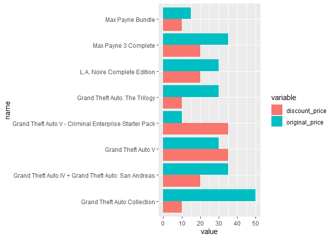
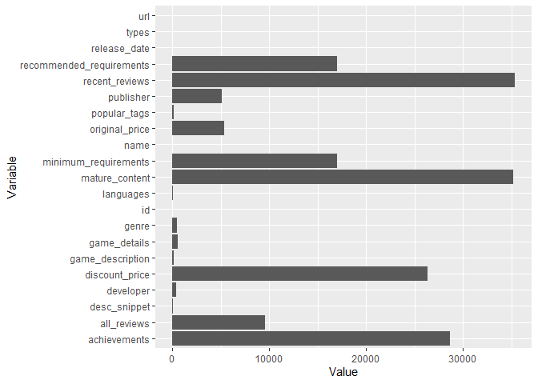
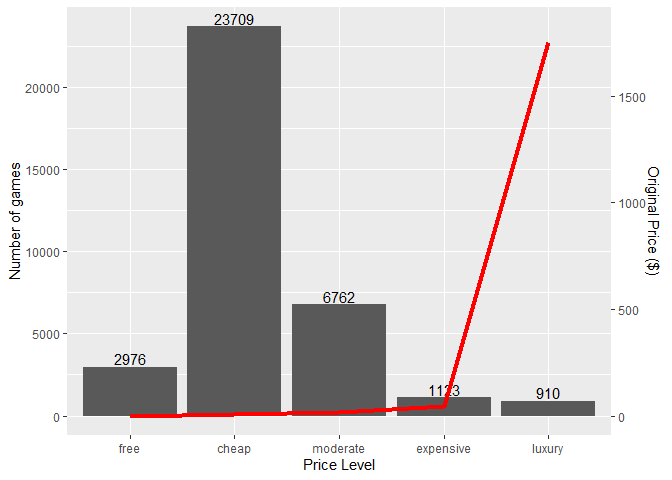
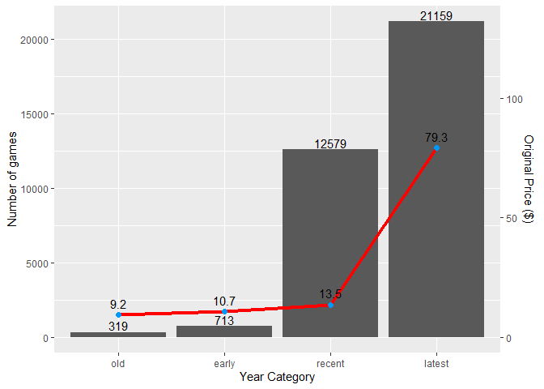
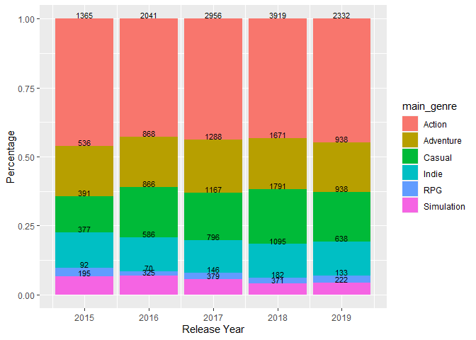
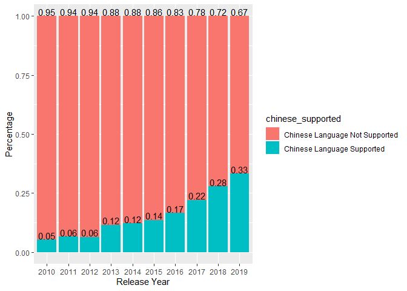

Mini Data-Analysis Deliverable 1
================

# Welcome to your (maybe) first-ever data analysis project!

And hopefully the first of many. Let’s get started:

1.  Install the [`datateachr`](https://github.com/UBC-MDS/datateachr)
    package by typing the following into your **R terminal**:

<!-- -->

    install.packages("devtools")
    devtools::install_github("UBC-MDS/datateachr")

2.  Load the packages below.

``` r
library(datateachr)
library(tidyverse)
```

    ## ── Attaching packages ─────────────────────────────────────── tidyverse 1.3.2 ──
    ## ✔ ggplot2 3.3.6      ✔ purrr   0.3.4 
    ## ✔ tibble  3.1.8      ✔ dplyr   1.0.10
    ## ✔ tidyr   1.2.1      ✔ stringr 1.4.1 
    ## ✔ readr   2.1.3      ✔ forcats 0.5.2 
    ## ── Conflicts ────────────────────────────────────────── tidyverse_conflicts() ──
    ## ✖ dplyr::filter() masks stats::filter()
    ## ✖ dplyr::lag()    masks stats::lag()

3.  Make a repository in the <https://github.com/stat545ubc-2022>
    Organization. You will be working with this repository for the
    entire data analysis project. You can either make it public, or make
    it private and add the TA’s and Lucy as collaborators. A link to
    help you create a private repository is available on the
    \#collaborative-project Slack channel.

# Instructions

## For Both Milestones

- Each milestone is worth 45 points. The number of points allocated to
  each task will be annotated within each deliverable. Tasks that are
  more challenging will often be allocated more points.

- 10 points will be allocated to the reproducibility, cleanliness, and
  coherence of the overall analysis. While the two milestones will be
  submitted as independent deliverables, the analysis itself is a
  continuum - think of it as two chapters to a story. Each chapter, or
  in this case, portion of your analysis, should be easily followed
  through by someone unfamiliar with the content.
  [Here](https://swcarpentry.github.io/r-novice-inflammation/06-best-practices-R/)
  is a good resource for what constitutes “good code”. Learning good
  coding practices early in your career will save you hassle later on!

## For Milestone 1

**To complete this milestone**, edit [this very `.Rmd`
file](https://raw.githubusercontent.com/UBC-STAT/stat545.stat.ubc.ca/master/content/mini-project/mini-project-1.Rmd)
directly. Fill in the sections that are tagged with
`<!--- start your work below --->`.

**To submit this milestone**, make sure to knit this `.Rmd` file to an
`.md` file by changing the YAML output settings from
`output: html_document` to `output: github_document`. Commit and push
all of your work to the mini-analysis GitHub repository you made
earlier, and tag a release on GitHub. Then, submit a link to your tagged
release on canvas.

**Points**: This milestone is worth 45 points: 43 for your analysis, 1
point for having your Milestone 1 document knit error-free, and 1 point
for tagging your release on Github.

# Learning Objectives

By the end of this milestone, you should:

- Become familiar with your dataset of choosing
- Select 4 questions that you would like to answer with your data
- Generate a reproducible and clear report using R Markdown
- Become familiar with manipulating and summarizing your data in tibbles
  using `dplyr`, with a research question in mind.

# Task 1: Choose your favorite dataset (10 points)

The `datateachr` package by Hayley Boyce and Jordan Bourak currently
composed of 7 semi-tidy datasets for educational purposes. Here is a
brief description of each dataset:

- *apt_buildings*: Acquired courtesy of The City of Toronto’s Open Data
  Portal. It currently has 3455 rows and 37 columns.

- *building_permits*: Acquired courtesy of The City of Vancouver’s Open
  Data Portal. It currently has 20680 rows and 14 columns.

- *cancer_sample*: Acquired courtesy of UCI Machine Learning Repository.
  It currently has 569 rows and 32 columns.

- *flow_sample*: Acquired courtesy of The Government of Canada’s
  Historical Hydrometric Database. It currently has 218 rows and 7
  columns.

- *parking_meters*: Acquired courtesy of The City of Vancouver’s Open
  Data Portal. It currently has 10032 rows and 22 columns.

- *steam_games*: Acquired courtesy of Kaggle. It currently has 40833
  rows and 21 columns.

- *vancouver_trees*: Acquired courtesy of The City of Vancouver’s Open
  Data Portal. It currently has 146611 rows and 20 columns.

**Things to keep in mind**

- We hope that this project will serve as practice for carrying our your
  own *independent* data analysis. Remember to comment your code, be
  explicit about what you are doing, and write notes in this markdown
  document when you feel that context is required. As you advance in the
  project, prompts and hints to do this will be diminished - it’ll be up
  to you!

- Before choosing a dataset, you should always keep in mind **your
  goal**, or in other ways, *what you wish to achieve with this data*.
  This mini data-analysis project focuses on *data wrangling*,
  *tidying*, and *visualization*. In short, it’s a way for you to get
  your feet wet with exploring data on your own.

And that is exactly the first thing that you will do!

1.1 Out of the 7 datasets available in the `datateachr` package, choose
**4** that appeal to you based on their description. Write your choices
below:

**Note**: We encourage you to use the ones in the `datateachr` package,
but if you have a dataset that you’d really like to use, you can include
it here. But, please check with a member of the teaching team to see
whether the dataset is of appropriate complexity. Also, include a
**brief** description of the dataset here to help the teaching team
understand your data.

<!-------------------------- Start your work below ---------------------------->

1.  `steam_games`
2.  `apt_buildings`
3.  `cancer_sample`
4.  `vancouver_trees`

<!----------------------------------------------------------------------------->

1.2 One way to narrowing down your selection is to *explore* the
datasets. Use your knowledge of dplyr to find out at least *3*
attributes about each of these datasets (an attribute is something such
as number of rows, variables, class type…). The goal here is to have an
idea of *what the data looks like*.

*Hint:* This is one of those times when you should think about the
cleanliness of your analysis. I added a single code chunk for you below,
but do you want to use more than one? Would you like to write more
comments outside of the code chunk?

<!-------------------------- Start your work below ---------------------------->

------------------------------------------------------------------------

- **Attribute 1**: Number of Rows  
- **Attribute 2**: Number of Variables  
- **Attribute 3**: List of all variables and types of variables  

Attributes of `steam_games` dataset:

``` r
glimpse(steam_games)
```

    ## Rows: 40,833
    ## Columns: 21
    ## $ id                       <dbl> 1, 2, 3, 4, 5, 6, 7, 8, 9, 10, 11, 12, 13, 14…
    ## $ url                      <chr> "https://store.steampowered.com/app/379720/DO…
    ## $ types                    <chr> "app", "app", "app", "app", "app", "bundle", …
    ## $ name                     <chr> "DOOM", "PLAYERUNKNOWN'S BATTLEGROUNDS", "BAT…
    ## $ desc_snippet             <chr> "Now includes all three premium DLC packs (Un…
    ## $ recent_reviews           <chr> "Very Positive,(554),- 89% of the 554 user re…
    ## $ all_reviews              <chr> "Very Positive,(42,550),- 92% of the 42,550 u…
    ## $ release_date             <chr> "May 12, 2016", "Dec 21, 2017", "Apr 24, 2018…
    ## $ developer                <chr> "id Software", "PUBG Corporation", "Harebrain…
    ## $ publisher                <chr> "Bethesda Softworks,Bethesda Softworks", "PUB…
    ## $ popular_tags             <chr> "FPS,Gore,Action,Demons,Shooter,First-Person,…
    ## $ game_details             <chr> "Single-player,Multi-player,Co-op,Steam Achie…
    ## $ languages                <chr> "English,French,Italian,German,Spanish - Spai…
    ## $ achievements             <dbl> 54, 37, 128, NA, NA, NA, 51, 55, 34, 43, 72, …
    ## $ genre                    <chr> "Action", "Action,Adventure,Massively Multipl…
    ## $ game_description         <chr> "About This Game Developed by id software, th…
    ## $ mature_content           <chr> NA, "Mature Content Description  The develope…
    ## $ minimum_requirements     <chr> "Minimum:,OS:,Windows 7/8.1/10 (64-bit versio…
    ## $ recommended_requirements <chr> "Recommended:,OS:,Windows 7/8.1/10 (64-bit ve…
    ## $ original_price           <dbl> 19.99, 29.99, 39.99, 44.99, 0.00, NA, 59.99, …
    ## $ discount_price           <dbl> 14.99, NA, NA, NA, NA, 35.18, 70.42, 17.58, N…

``` r
steam_games %>% head %>% collect %>% lapply(typeof) %>% unlist
```

    ##                       id                      url                    types 
    ##                 "double"              "character"              "character" 
    ##                     name             desc_snippet           recent_reviews 
    ##              "character"              "character"              "character" 
    ##              all_reviews             release_date                developer 
    ##              "character"              "character"              "character" 
    ##                publisher             popular_tags             game_details 
    ##              "character"              "character"              "character" 
    ##                languages             achievements                    genre 
    ##              "character"                 "double"              "character" 
    ##         game_description           mature_content     minimum_requirements 
    ##              "character"              "character"              "character" 
    ## recommended_requirements           original_price           discount_price 
    ##              "character"                 "double"                 "double"

------------------------------------------------------------------------

Attributes of `vancouver_trees` dataset:

``` r
glimpse(vancouver_trees)
```

    ## Rows: 146,611
    ## Columns: 20
    ## $ tree_id            <dbl> 149556, 149563, 149579, 149590, 149604, 149616, 149…
    ## $ civic_number       <dbl> 494, 450, 4994, 858, 5032, 585, 4909, 4925, 4969, 7…
    ## $ std_street         <chr> "W 58TH AV", "W 58TH AV", "WINDSOR ST", "E 39TH AV"…
    ## $ genus_name         <chr> "ULMUS", "ZELKOVA", "STYRAX", "FRAXINUS", "ACER", "…
    ## $ species_name       <chr> "AMERICANA", "SERRATA", "JAPONICA", "AMERICANA", "C…
    ## $ cultivar_name      <chr> "BRANDON", NA, NA, "AUTUMN APPLAUSE", NA, "CHANTICL…
    ## $ common_name        <chr> "BRANDON ELM", "JAPANESE ZELKOVA", "JAPANESE SNOWBE…
    ## $ assigned           <chr> "N", "N", "N", "Y", "N", "N", "N", "N", "N", "N", "…
    ## $ root_barrier       <chr> "N", "N", "N", "N", "N", "N", "N", "N", "N", "N", "…
    ## $ plant_area         <chr> "N", "N", "4", "4", "4", "B", "6", "6", "3", "3", "…
    ## $ on_street_block    <dbl> 400, 400, 4900, 800, 5000, 500, 4900, 4900, 4900, 7…
    ## $ on_street          <chr> "W 58TH AV", "W 58TH AV", "WINDSOR ST", "E 39TH AV"…
    ## $ neighbourhood_name <chr> "MARPOLE", "MARPOLE", "KENSINGTON-CEDAR COTTAGE", "…
    ## $ street_side_name   <chr> "EVEN", "EVEN", "EVEN", "EVEN", "EVEN", "ODD", "ODD…
    ## $ height_range_id    <dbl> 2, 4, 3, 4, 2, 2, 3, 3, 2, 2, 2, 5, 3, 2, 2, 2, 2, …
    ## $ diameter           <dbl> 10.00, 10.00, 4.00, 18.00, 9.00, 5.00, 15.00, 14.00…
    ## $ curb               <chr> "N", "N", "Y", "Y", "Y", "Y", "Y", "Y", "Y", "Y", "…
    ## $ date_planted       <date> 1999-01-13, 1996-05-31, 1993-11-22, 1996-04-29, 19…
    ## $ longitude          <dbl> -123.1161, -123.1147, -123.0846, -123.0870, -123.08…
    ## $ latitude           <dbl> 49.21776, 49.21776, 49.23938, 49.23469, 49.23894, 4…

``` r
vancouver_trees %>% head %>% collect %>% lapply(typeof) %>% unlist
```

    ##            tree_id       civic_number         std_street         genus_name 
    ##           "double"           "double"        "character"        "character" 
    ##       species_name      cultivar_name        common_name           assigned 
    ##        "character"        "character"        "character"        "character" 
    ##       root_barrier         plant_area    on_street_block          on_street 
    ##        "character"        "character"           "double"        "character" 
    ## neighbourhood_name   street_side_name    height_range_id           diameter 
    ##        "character"        "character"           "double"           "double" 
    ##               curb       date_planted          longitude           latitude 
    ##        "character"           "double"           "double"           "double"

------------------------------------------------------------------------

Attributes of `cancer_sample` dataset:

``` r
glimpse(cancer_sample)
```

    ## Rows: 569
    ## Columns: 32
    ## $ ID                      <dbl> 842302, 842517, 84300903, 84348301, 84358402, …
    ## $ diagnosis               <chr> "M", "M", "M", "M", "M", "M", "M", "M", "M", "…
    ## $ radius_mean             <dbl> 17.990, 20.570, 19.690, 11.420, 20.290, 12.450…
    ## $ texture_mean            <dbl> 10.38, 17.77, 21.25, 20.38, 14.34, 15.70, 19.9…
    ## $ perimeter_mean          <dbl> 122.80, 132.90, 130.00, 77.58, 135.10, 82.57, …
    ## $ area_mean               <dbl> 1001.0, 1326.0, 1203.0, 386.1, 1297.0, 477.1, …
    ## $ smoothness_mean         <dbl> 0.11840, 0.08474, 0.10960, 0.14250, 0.10030, 0…
    ## $ compactness_mean        <dbl> 0.27760, 0.07864, 0.15990, 0.28390, 0.13280, 0…
    ## $ concavity_mean          <dbl> 0.30010, 0.08690, 0.19740, 0.24140, 0.19800, 0…
    ## $ concave_points_mean     <dbl> 0.14710, 0.07017, 0.12790, 0.10520, 0.10430, 0…
    ## $ symmetry_mean           <dbl> 0.2419, 0.1812, 0.2069, 0.2597, 0.1809, 0.2087…
    ## $ fractal_dimension_mean  <dbl> 0.07871, 0.05667, 0.05999, 0.09744, 0.05883, 0…
    ## $ radius_se               <dbl> 1.0950, 0.5435, 0.7456, 0.4956, 0.7572, 0.3345…
    ## $ texture_se              <dbl> 0.9053, 0.7339, 0.7869, 1.1560, 0.7813, 0.8902…
    ## $ perimeter_se            <dbl> 8.589, 3.398, 4.585, 3.445, 5.438, 2.217, 3.18…
    ## $ area_se                 <dbl> 153.40, 74.08, 94.03, 27.23, 94.44, 27.19, 53.…
    ## $ smoothness_se           <dbl> 0.006399, 0.005225, 0.006150, 0.009110, 0.0114…
    ## $ compactness_se          <dbl> 0.049040, 0.013080, 0.040060, 0.074580, 0.0246…
    ## $ concavity_se            <dbl> 0.05373, 0.01860, 0.03832, 0.05661, 0.05688, 0…
    ## $ concave_points_se       <dbl> 0.015870, 0.013400, 0.020580, 0.018670, 0.0188…
    ## $ symmetry_se             <dbl> 0.03003, 0.01389, 0.02250, 0.05963, 0.01756, 0…
    ## $ fractal_dimension_se    <dbl> 0.006193, 0.003532, 0.004571, 0.009208, 0.0051…
    ## $ radius_worst            <dbl> 25.38, 24.99, 23.57, 14.91, 22.54, 15.47, 22.8…
    ## $ texture_worst           <dbl> 17.33, 23.41, 25.53, 26.50, 16.67, 23.75, 27.6…
    ## $ perimeter_worst         <dbl> 184.60, 158.80, 152.50, 98.87, 152.20, 103.40,…
    ## $ area_worst              <dbl> 2019.0, 1956.0, 1709.0, 567.7, 1575.0, 741.6, …
    ## $ smoothness_worst        <dbl> 0.1622, 0.1238, 0.1444, 0.2098, 0.1374, 0.1791…
    ## $ compactness_worst       <dbl> 0.6656, 0.1866, 0.4245, 0.8663, 0.2050, 0.5249…
    ## $ concavity_worst         <dbl> 0.71190, 0.24160, 0.45040, 0.68690, 0.40000, 0…
    ## $ concave_points_worst    <dbl> 0.26540, 0.18600, 0.24300, 0.25750, 0.16250, 0…
    ## $ symmetry_worst          <dbl> 0.4601, 0.2750, 0.3613, 0.6638, 0.2364, 0.3985…
    ## $ fractal_dimension_worst <dbl> 0.11890, 0.08902, 0.08758, 0.17300, 0.07678, 0…

``` r
cancer_sample %>% head %>% collect %>% lapply(typeof) %>% unlist
```

    ##                      ID               diagnosis             radius_mean 
    ##                "double"             "character"                "double" 
    ##            texture_mean          perimeter_mean               area_mean 
    ##                "double"                "double"                "double" 
    ##         smoothness_mean        compactness_mean          concavity_mean 
    ##                "double"                "double"                "double" 
    ##     concave_points_mean           symmetry_mean  fractal_dimension_mean 
    ##                "double"                "double"                "double" 
    ##               radius_se              texture_se            perimeter_se 
    ##                "double"                "double"                "double" 
    ##                 area_se           smoothness_se          compactness_se 
    ##                "double"                "double"                "double" 
    ##            concavity_se       concave_points_se             symmetry_se 
    ##                "double"                "double"                "double" 
    ##    fractal_dimension_se            radius_worst           texture_worst 
    ##                "double"                "double"                "double" 
    ##         perimeter_worst              area_worst        smoothness_worst 
    ##                "double"                "double"                "double" 
    ##       compactness_worst         concavity_worst    concave_points_worst 
    ##                "double"                "double"                "double" 
    ##          symmetry_worst fractal_dimension_worst 
    ##                "double"                "double"

------------------------------------------------------------------------

Attributes of `apt_buildings` dataset:

``` r
glimpse(apt_buildings)
```

    ## Rows: 3,455
    ## Columns: 37
    ## $ id                               <dbl> 10359, 10360, 10361, 10362, 10363, 10…
    ## $ air_conditioning                 <chr> "NONE", "NONE", "NONE", "NONE", "NONE…
    ## $ amenities                        <chr> "Outdoor rec facilities", "Outdoor po…
    ## $ balconies                        <chr> "YES", "YES", "YES", "YES", "NO", "NO…
    ## $ barrier_free_accessibilty_entr   <chr> "YES", "NO", "NO", "YES", "NO", "NO",…
    ## $ bike_parking                     <chr> "0 indoor parking spots and 10 outdoo…
    ## $ exterior_fire_escape             <chr> "NO", "NO", "NO", "YES", "NO", NA, "N…
    ## $ fire_alarm                       <chr> "YES", "YES", "YES", "YES", "YES", "Y…
    ## $ garbage_chutes                   <chr> "YES", "YES", "NO", "NO", "NO", "NO",…
    ## $ heating_type                     <chr> "HOT WATER", "HOT WATER", "HOT WATER"…
    ## $ intercom                         <chr> "YES", "YES", "YES", "YES", "YES", "Y…
    ## $ laundry_room                     <chr> "YES", "YES", "YES", "YES", "YES", "Y…
    ## $ locker_or_storage_room           <chr> "NO", "YES", "YES", "YES", "NO", "YES…
    ## $ no_of_elevators                  <dbl> 3, 3, 0, 1, 0, 0, 0, 2, 4, 2, 0, 2, 2…
    ## $ parking_type                     <chr> "Underground Garage , Garage accessib…
    ## $ pets_allowed                     <chr> "YES", "YES", "YES", "YES", "YES", "Y…
    ## $ prop_management_company_name     <chr> NA, "SCHICKEDANZ BROS. PROPERTIES", N…
    ## $ property_type                    <chr> "PRIVATE", "PRIVATE", "PRIVATE", "PRI…
    ## $ rsn                              <dbl> 4154812, 4154815, 4155295, 4155309, 4…
    ## $ separate_gas_meters              <chr> "NO", "NO", "NO", "NO", "NO", "NO", "…
    ## $ separate_hydro_meters            <chr> "YES", "YES", "YES", "YES", "YES", "Y…
    ## $ separate_water_meters            <chr> "NO", "NO", "NO", "NO", "NO", "NO", "…
    ## $ site_address                     <chr> "65  FOREST MANOR RD", "70  CLIPPER R…
    ## $ sprinkler_system                 <chr> "YES", "YES", "NO", "YES", "NO", "NO"…
    ## $ visitor_parking                  <chr> "PAID", "FREE", "UNAVAILABLE", "UNAVA…
    ## $ ward                             <chr> "17", "17", "03", "03", "02", "02", "…
    ## $ window_type                      <chr> "DOUBLE PANE", "DOUBLE PANE", "DOUBLE…
    ## $ year_built                       <dbl> 1967, 1970, 1927, 1959, 1943, 1952, 1…
    ## $ year_registered                  <dbl> 2017, 2017, 2017, 2017, 2017, NA, 201…
    ## $ no_of_storeys                    <dbl> 17, 14, 4, 5, 4, 4, 4, 7, 32, 4, 4, 7…
    ## $ emergency_power                  <chr> "NO", "YES", "NO", "NO", "NO", "NO", …
    ## $ `non-smoking_building`           <chr> "YES", "NO", "YES", "YES", "YES", "NO…
    ## $ no_of_units                      <dbl> 218, 206, 34, 42, 25, 34, 14, 105, 57…
    ## $ no_of_accessible_parking_spaces  <dbl> 8, 10, 20, 42, 12, 0, 5, 1, 1, 6, 12,…
    ## $ facilities_available             <chr> "Recycling bins", "Green Bin / Organi…
    ## $ cooling_room                     <chr> "NO", "NO", "NO", "NO", "NO", "NO", "…
    ## $ no_barrier_free_accessible_units <dbl> 2, 0, 0, 42, 0, NA, 14, 0, 0, 1, 25, …

``` r
apt_buildings %>% head %>% collect %>% lapply(typeof) %>% unlist
```

    ##                               id                 air_conditioning 
    ##                         "double"                      "character" 
    ##                        amenities                        balconies 
    ##                      "character"                      "character" 
    ##   barrier_free_accessibilty_entr                     bike_parking 
    ##                      "character"                      "character" 
    ##             exterior_fire_escape                       fire_alarm 
    ##                      "character"                      "character" 
    ##                   garbage_chutes                     heating_type 
    ##                      "character"                      "character" 
    ##                         intercom                     laundry_room 
    ##                      "character"                      "character" 
    ##           locker_or_storage_room                  no_of_elevators 
    ##                      "character"                         "double" 
    ##                     parking_type                     pets_allowed 
    ##                      "character"                      "character" 
    ##     prop_management_company_name                    property_type 
    ##                      "character"                      "character" 
    ##                              rsn              separate_gas_meters 
    ##                         "double"                      "character" 
    ##            separate_hydro_meters            separate_water_meters 
    ##                      "character"                      "character" 
    ##                     site_address                 sprinkler_system 
    ##                      "character"                      "character" 
    ##                  visitor_parking                             ward 
    ##                      "character"                      "character" 
    ##                      window_type                       year_built 
    ##                      "character"                         "double" 
    ##                  year_registered                    no_of_storeys 
    ##                         "double"                         "double" 
    ##                  emergency_power             non-smoking_building 
    ##                      "character"                      "character" 
    ##                      no_of_units  no_of_accessible_parking_spaces 
    ##                         "double"                         "double" 
    ##             facilities_available                     cooling_room 
    ##                      "character"                      "character" 
    ## no_barrier_free_accessible_units 
    ##                         "double"

<!----------------------------------------------------------------------------->

1.3 Now that you’ve explored the 4 datasets that you were initially most
interested in, let’s narrow it down to 2. What lead you to choose these
2? Briefly explain your choices below, and feel free to include any code
in your explanation.

<!-------------------------- Start your work below ---------------------------->

**Answer**: I decide to choose `steam_games` and `apt_buildings` since I
have knowledge and interest in these two fields. I don’t choose
`cancer_sample` and `vancouver_trees` since they require decent
knowledge about medical or forestry to do a robust analysis.  

For `steam_games`, I am curious about how the gaming industries
developed in the past years by analyzing relationships between
release_date and prices/requirements/reviews/developer/etc.

``` r
glimpse(steam_games)
```

    ## Rows: 40,833
    ## Columns: 21
    ## $ id                       <dbl> 1, 2, 3, 4, 5, 6, 7, 8, 9, 10, 11, 12, 13, 14…
    ## $ url                      <chr> "https://store.steampowered.com/app/379720/DO…
    ## $ types                    <chr> "app", "app", "app", "app", "app", "bundle", …
    ## $ name                     <chr> "DOOM", "PLAYERUNKNOWN'S BATTLEGROUNDS", "BAT…
    ## $ desc_snippet             <chr> "Now includes all three premium DLC packs (Un…
    ## $ recent_reviews           <chr> "Very Positive,(554),- 89% of the 554 user re…
    ## $ all_reviews              <chr> "Very Positive,(42,550),- 92% of the 42,550 u…
    ## $ release_date             <chr> "May 12, 2016", "Dec 21, 2017", "Apr 24, 2018…
    ## $ developer                <chr> "id Software", "PUBG Corporation", "Harebrain…
    ## $ publisher                <chr> "Bethesda Softworks,Bethesda Softworks", "PUB…
    ## $ popular_tags             <chr> "FPS,Gore,Action,Demons,Shooter,First-Person,…
    ## $ game_details             <chr> "Single-player,Multi-player,Co-op,Steam Achie…
    ## $ languages                <chr> "English,French,Italian,German,Spanish - Spai…
    ## $ achievements             <dbl> 54, 37, 128, NA, NA, NA, 51, 55, 34, 43, 72, …
    ## $ genre                    <chr> "Action", "Action,Adventure,Massively Multipl…
    ## $ game_description         <chr> "About This Game Developed by id software, th…
    ## $ mature_content           <chr> NA, "Mature Content Description  The develope…
    ## $ minimum_requirements     <chr> "Minimum:,OS:,Windows 7/8.1/10 (64-bit versio…
    ## $ recommended_requirements <chr> "Recommended:,OS:,Windows 7/8.1/10 (64-bit ve…
    ## $ original_price           <dbl> 19.99, 29.99, 39.99, 44.99, 0.00, NA, 59.99, …
    ## $ discount_price           <dbl> 14.99, NA, NA, NA, NA, 35.18, 70.42, 17.58, N…

For `apt_buildings`, I would like to know the relationship between
facilities (e.g., air_conditioning, heating, and ward, etc.) and
year_built. Since it has the most number of columns (37) among the
datasets, there will be many aspects/directions I can conduct analysis
on.

``` r
glimpse(apt_buildings)
```

    ## Rows: 3,455
    ## Columns: 37
    ## $ id                               <dbl> 10359, 10360, 10361, 10362, 10363, 10…
    ## $ air_conditioning                 <chr> "NONE", "NONE", "NONE", "NONE", "NONE…
    ## $ amenities                        <chr> "Outdoor rec facilities", "Outdoor po…
    ## $ balconies                        <chr> "YES", "YES", "YES", "YES", "NO", "NO…
    ## $ barrier_free_accessibilty_entr   <chr> "YES", "NO", "NO", "YES", "NO", "NO",…
    ## $ bike_parking                     <chr> "0 indoor parking spots and 10 outdoo…
    ## $ exterior_fire_escape             <chr> "NO", "NO", "NO", "YES", "NO", NA, "N…
    ## $ fire_alarm                       <chr> "YES", "YES", "YES", "YES", "YES", "Y…
    ## $ garbage_chutes                   <chr> "YES", "YES", "NO", "NO", "NO", "NO",…
    ## $ heating_type                     <chr> "HOT WATER", "HOT WATER", "HOT WATER"…
    ## $ intercom                         <chr> "YES", "YES", "YES", "YES", "YES", "Y…
    ## $ laundry_room                     <chr> "YES", "YES", "YES", "YES", "YES", "Y…
    ## $ locker_or_storage_room           <chr> "NO", "YES", "YES", "YES", "NO", "YES…
    ## $ no_of_elevators                  <dbl> 3, 3, 0, 1, 0, 0, 0, 2, 4, 2, 0, 2, 2…
    ## $ parking_type                     <chr> "Underground Garage , Garage accessib…
    ## $ pets_allowed                     <chr> "YES", "YES", "YES", "YES", "YES", "Y…
    ## $ prop_management_company_name     <chr> NA, "SCHICKEDANZ BROS. PROPERTIES", N…
    ## $ property_type                    <chr> "PRIVATE", "PRIVATE", "PRIVATE", "PRI…
    ## $ rsn                              <dbl> 4154812, 4154815, 4155295, 4155309, 4…
    ## $ separate_gas_meters              <chr> "NO", "NO", "NO", "NO", "NO", "NO", "…
    ## $ separate_hydro_meters            <chr> "YES", "YES", "YES", "YES", "YES", "Y…
    ## $ separate_water_meters            <chr> "NO", "NO", "NO", "NO", "NO", "NO", "…
    ## $ site_address                     <chr> "65  FOREST MANOR RD", "70  CLIPPER R…
    ## $ sprinkler_system                 <chr> "YES", "YES", "NO", "YES", "NO", "NO"…
    ## $ visitor_parking                  <chr> "PAID", "FREE", "UNAVAILABLE", "UNAVA…
    ## $ ward                             <chr> "17", "17", "03", "03", "02", "02", "…
    ## $ window_type                      <chr> "DOUBLE PANE", "DOUBLE PANE", "DOUBLE…
    ## $ year_built                       <dbl> 1967, 1970, 1927, 1959, 1943, 1952, 1…
    ## $ year_registered                  <dbl> 2017, 2017, 2017, 2017, 2017, NA, 201…
    ## $ no_of_storeys                    <dbl> 17, 14, 4, 5, 4, 4, 4, 7, 32, 4, 4, 7…
    ## $ emergency_power                  <chr> "NO", "YES", "NO", "NO", "NO", "NO", …
    ## $ `non-smoking_building`           <chr> "YES", "NO", "YES", "YES", "YES", "NO…
    ## $ no_of_units                      <dbl> 218, 206, 34, 42, 25, 34, 14, 105, 57…
    ## $ no_of_accessible_parking_spaces  <dbl> 8, 10, 20, 42, 12, 0, 5, 1, 1, 6, 12,…
    ## $ facilities_available             <chr> "Recycling bins", "Green Bin / Organi…
    ## $ cooling_room                     <chr> "NO", "NO", "NO", "NO", "NO", "NO", "…
    ## $ no_barrier_free_accessible_units <dbl> 2, 0, 0, 42, 0, NA, 14, 0, 0, 1, 25, …

<!----------------------------------------------------------------------------->

1.4 Time for the final decision! Going back to the beginning, it’s
important to have an *end goal* in mind. For example, if I had chosen
the `titanic` dataset for my project, I might’ve wanted to explore the
relationship between survival and other variables. Try to think of 1
research question that you would want to answer with each dataset. Note
them down below, and make your final choice based on what seems more
interesting to you!

<!-------------------------- Start your work below ---------------------------->

- `steam_games`: What variables reflect changes in the game industry
  year by year, and how do they reflect them?
- `cancer_sample`: What variables affect the diagnosis of cancer?
- `vancouver_trees`: What variables affect the diameter of tree?
- `apt_buildings`: How types of facilities changed by year of
  construction?

**Final decision**: `steam_games`  
I’m interested in analysing relationships between variables to see how
the gaming industries have changed over the years.
<!----------------------------------------------------------------------------->

# Important note

Read Tasks 2 and 3 *fully* before starting to complete either of them.
Probably also a good point to grab a coffee to get ready for the fun
part!

This project is semi-guided, but meant to be *independent*. For this
reason, you will complete tasks 2 and 3 below (under the **START HERE**
mark) as if you were writing your own exploratory data analysis report,
and this guidance never existed! Feel free to add a brief introduction
section to your project, format the document with markdown syntax as you
deem appropriate, and structure the analysis as you deem appropriate.
Remember, marks will be awarded for completion of the 4 tasks, but 10
points of the whole project are allocated to a reproducible and clean
analysis. If you feel lost, you can find a sample data analysis
[here](https://www.kaggle.com/headsortails/tidy-titarnic) to have a
better idea. However, bear in mind that it is **just an example** and
you will not be required to have that level of complexity in your
project.

# Task 2: Exploring your dataset (15 points)

If we rewind and go back to the learning objectives, you’ll see that by
the end of this deliverable, you should have formulated *4* research
questions about your data that you may want to answer during your
project. However, it may be handy to do some more exploration on your
dataset of choice before creating these questions - by looking at the
data, you may get more ideas. **Before you start this task, read all
instructions carefully until you reach START HERE under Task 3**.

2.1 Complete *4 out of the following 8 exercises* to dive deeper into
your data. All datasets are different and therefore, not all of these
tasks may make sense for your data - which is why you should only answer
*4*. Use *dplyr* and *ggplot*.

**1. Plot the distribution of a numeric variable.**  
**2. Create a new variable based on other variables in your data (only
if it makes sense)**  
**3. Investigate how many missing values there are per variable. Can you
find a way to plot this?**  
4. Explore the relationship between 2 variables in a plot.  
5. Filter observations in your data according to your own criteria.
Think of what you’d like to explore - again, if this was the `titanic`
dataset, I may want to narrow my search down to passengers born in a
particular year…  
6. Use a boxplot to look at the frequency of different observations
within a single variable. You can do this for more than one variable if
you wish!  
**7. Make a new tibble with a subset of your data, with variables and
observations that you are interested in exploring.**  
8. Use a density plot to explore any of your variables (that are
suitable for this type of plot).  

2.2 For each of the 4 exercises that you complete, provide a *brief
explanation* of why you chose that exercise in relation to your data (in
other words, why does it make sense to do that?), and sufficient
comments for a reader to understand your reasoning and code.

<!-------------------------- Start your work below ---------------------------->

1.  Plot the distribution of a numeric variable.

``` r
rs_prices <- steam_games[!is.na(steam_games$original_price) 
                         & !is.na(steam_games$discount_price) 
                         & steam_games$original_price > 0 
                         & grepl("Rockstar", steam_games$publisher), ] %>% 
             select(name, original_price, discount_price)

rs_prices <- rs_prices %>% pivot_longer(-name, names_to="variable", values_to="value")

rs_prices_plot <- ggplot(rs_prices, aes(x = name,y = value)) + 
    geom_bar(aes(fill = variable),stat = "identity",position = "dodge") + coord_flip()
print(rs_prices_plot)
```

<!-- -->

In this exercise, I plot the distribution of numeric variables
`discount_price` and `original_price` for games published by Rockstar
Games. I chose this exercise since I am curious about what the discount
on Rockstar’s games looks like. I found it interesting that the popular
games usually have discount prices higher than the original prices.

------------------------------------------------------------------------

2.  Create a new variable based on other variables in your data (only if
    it makes sense)

``` r
substrRight <- function(x, n) { substr(x, nchar(x)-n+1, nchar(x)) }
steam_games_with_release_year <- steam_games %>% mutate(release_year=as.numeric(substrRight(release_date, 4)))
```

    ## Warning in mask$eval_all_mutate(quo): NAs introduced by coercion

``` r
glimpse(steam_games_with_release_year)
```

    ## Rows: 40,833
    ## Columns: 22
    ## $ id                       <dbl> 1, 2, 3, 4, 5, 6, 7, 8, 9, 10, 11, 12, 13, 14…
    ## $ url                      <chr> "https://store.steampowered.com/app/379720/DO…
    ## $ types                    <chr> "app", "app", "app", "app", "app", "bundle", …
    ## $ name                     <chr> "DOOM", "PLAYERUNKNOWN'S BATTLEGROUNDS", "BAT…
    ## $ desc_snippet             <chr> "Now includes all three premium DLC packs (Un…
    ## $ recent_reviews           <chr> "Very Positive,(554),- 89% of the 554 user re…
    ## $ all_reviews              <chr> "Very Positive,(42,550),- 92% of the 42,550 u…
    ## $ release_date             <chr> "May 12, 2016", "Dec 21, 2017", "Apr 24, 2018…
    ## $ developer                <chr> "id Software", "PUBG Corporation", "Harebrain…
    ## $ publisher                <chr> "Bethesda Softworks,Bethesda Softworks", "PUB…
    ## $ popular_tags             <chr> "FPS,Gore,Action,Demons,Shooter,First-Person,…
    ## $ game_details             <chr> "Single-player,Multi-player,Co-op,Steam Achie…
    ## $ languages                <chr> "English,French,Italian,German,Spanish - Spai…
    ## $ achievements             <dbl> 54, 37, 128, NA, NA, NA, 51, 55, 34, 43, 72, …
    ## $ genre                    <chr> "Action", "Action,Adventure,Massively Multipl…
    ## $ game_description         <chr> "About This Game Developed by id software, th…
    ## $ mature_content           <chr> NA, "Mature Content Description  The develope…
    ## $ minimum_requirements     <chr> "Minimum:,OS:,Windows 7/8.1/10 (64-bit versio…
    ## $ recommended_requirements <chr> "Recommended:,OS:,Windows 7/8.1/10 (64-bit ve…
    ## $ original_price           <dbl> 19.99, 29.99, 39.99, 44.99, 0.00, NA, 59.99, …
    ## $ discount_price           <dbl> 14.99, NA, NA, NA, NA, 35.18, 70.42, 17.58, N…
    ## $ release_year             <dbl> 2016, 2017, 2018, 2018, 2003, NaN, 2019, 2016…

In this exercise, I create a new variable `release_year` that contains
the year of game release by extracting the year from the variable
`release_date` in the dataset. I could use the `release_year` variable
to summarize my data by *year* later in Task 4.

------------------------------------------------------------------------

3.  Investigate how many missing values there are per variable. Can you
    find a way to plot this?

``` r
num_na <- cbind(Variable = "Value", steam_games %>% summarise_all(~sum(is.na(.))))
num_na <- pivot_longer(num_na, -Variable) %>%
          pivot_wider(name, names_from="Variable", values_from="value") %>%
          rename(Variable=name)
num_na_plot <- ggplot(num_na, aes(x=Variable, y=Value)) +
               geom_col() + coord_flip()
print(num_na_plot)
```

<!-- -->

In this exercise, I plot the number of missing values in each variable.
It is important since I need to know which variables are worth
analyzing. If there are many missing values, the variable is less worth
analyzing since there is not enough data to study its relationship with
other variables. From the graph, we see that `recent_reviews`,
`mature_content`, and `achievements` have the most missing values. We
can avoid studying their relationship with other variables.

------------------------------------------------------------------------

7.  Make a new tibble with a subset of your data, with variables and
    observations that you are interested in exploring.

``` r
# using our new dataset made above: steam_games_with_release_year
steam_games_genre_by_year <- as_tibble(steam_games_with_release_year %>% select(id, name, genre, release_year))
print(steam_games_genre_by_year)
```

    ## # A tibble: 40,833 × 4
    ##       id name                                       genre                relea…¹
    ##    <dbl> <chr>                                      <chr>                  <dbl>
    ##  1     1 DOOM                                       Action                  2016
    ##  2     2 PLAYERUNKNOWN'S BATTLEGROUNDS              Action,Adventure,Ma…    2017
    ##  3     3 BATTLETECH                                 Action,Adventure,St…    2018
    ##  4     4 DayZ                                       Action,Adventure,Ma…    2018
    ##  5     5 EVE Online                                 Action,Free to Play…    2003
    ##  6     6 Grand Theft Auto V: Premium Online Edition Action,Adventure         NaN
    ##  7     7 Devil May Cry 5                            Action                  2019
    ##  8     8 Human: Fall Flat                           Adventure,Indie         2016
    ##  9     9 They Are Billions                          Strategy,Early Acce…    2017
    ## 10    10 Warhammer: Chaosbane                       Action,Adventure,RPG    2019
    ## # … with 40,823 more rows, and abbreviated variable name ¹​release_year

In this exercise, I made a new tibble with a subset of `steam_games`
with variables `id`, `name`, `genre`, `release_year` (obtained in
exercise 2 above). I may use this tibble in task 4 to explore the genre
distribution in each year so that I can summarize the trend per year.

<!----------------------------------------------------------------------------->

# Task 3: Write your research questions (5 points)

So far, you have chosen a dataset and gotten familiar with it through
exploring the data. Now it’s time to figure out 4 research questions
that you would like to answer with your data! Write the 4 questions and
any additional comments at the end of this deliverable. These questions
are not necessarily set in stone - TAs will review them and give you
feedback; therefore, you may choose to pursue them as they are for the
rest of the project, or make modifications!

<!--- *****START HERE***** --->

### Research Questions:

1.  What is the overall distribution of games by price categories and
    the average price of each category (e.g., free, cheap, moderate,
    expensive, luxury)?
2.  What is the overall distribution of games by release year category
    and the average price of each category (e.g., old, early, recent,
    latest)?
3.  What is the distribution of the most popular genres each year during
    *2015 - 2019*?
4.  What is the percentage of games that supported Chinese each year
    during *2010 - 2019*?

<!---------------------------->

# Task 4: Process and summarize your data (13 points)

From Task 2, you should have an idea of the basic structure of your
dataset (e.g. number of rows and columns, class types, etc.). Here, we
will start investigating your data more in-depth using various data
manipulation functions.

### 1.1 (10 points)

Now, for each of your four research questions, choose one task from
options 1-4 (summarizing), and one other task from 4-8 (graphing). You
should have 2 tasks done for each research question (8 total). Make sure
it makes sense to do them! (e.g. don’t use a numerical variables for a
task that needs a categorical variable.). Comment on why each task helps
(or doesn’t!) answer the corresponding research question.

Ensure that the output of each operation is printed!

**Summarizing:**

1.  Compute the *range*, *mean*, and *two other summary statistics* of
    **one numerical variable** across the groups of **one categorical
    variable** from your data.
2.  Compute the number of observations for at least one of your
    categorical variables. Do not use the function `table()`!
3.  Create a categorical variable with 3 or more groups from an existing
    numerical variable. You can use this new variable in the other
    tasks! *An example: age in years into “child, teen, adult, senior”.*
4.  Based on two categorical variables, calculate two summary statistics
    of your choosing.

**Graphing:**

5.  Create a graph out of summarized variables that has at least two
    geom layers.
6.  Create a graph of your choosing, make one of the axes logarithmic,
    and format the axes labels so that they are “pretty” or easier to
    read.
7.  Make a graph where it makes sense to customize the alpha
    transparency.
8.  Create 3 histograms out of summarized variables, with each histogram
    having different sized bins. Pick the “best” one and explain why it
    is the best.

Make sure it’s clear what research question you are doing each operation
for!

------------------------------------------------------------------------

<!------------------------- Start your work below ----------------------------->

1.  What is the overall distribution of games by price categories and
    the average price of each category (e.g., free, cheap, moderate,
    expensive, luxury)?

**Summarizing Task**: 3. Create a categorical variable with 3 or more
groups from an existing numerical variable.  
**Graphing Task**: 5. Create a graph out of summarized variables that
has at least two geom layers (***geom_col & geom_line & geom_text***).  

``` r
original_prices_wo_na <- steam_games[!is.na(steam_games$original_price), ] %>% 
             select(id, name, original_price)
steam_games_price_categorized <- original_prices_wo_na %>% mutate(price_level=cut(original_price, breaks=c(-Inf, 0, 10, 30, 60, Inf), labels=c("free", "cheap", "moderate", "expensive", "luxury")))
summarised_price <- steam_games_price_categorized %>% 
                    select(original_price, price_level) %>%
                    group_by(price_level) %>%
                    summarise(across(where(is.numeric), mean, na.rm = TRUE), n=n())
print(summarised_price)
```

    ## # A tibble: 5 × 3
    ##   price_level original_price     n
    ##   <fct>                <dbl> <int>
    ## 1 free                  0     2976
    ## 2 cheap                 4.85 23709
    ## 3 moderate             18.6   6762
    ## 4 expensive            44.9   1123
    ## 5 luxury             1749.     910

``` r
summarised_price_level <- ggplot(summarised_price) + 
    labs(x = "Price Level", y = "Number of games") +
    geom_col(aes(x = price_level, y = n), size = 1) +
    geom_text(aes(x = price_level, y = n, label = n), vjust = -0.2) +
    geom_line(aes(x = price_level, y = 13*original_price), size = 1.5, color="red", group = 1) +
    scale_y_continuous(sec.axis = sec_axis(~./13, name = "Original Price ($)"))
print(summarised_price_level)
```

<!-- -->

I categorized the games into 5 price levels, `free` (\$0), `cheap` (\$0
\~ \$10\], `moderate` (\$10 \~ \$30\],`expensive` (\$30 \~ \$60\], and
`luxury` (\>\$60). As we can see in the chart, the majority of games are
in the `cheap` price range where the average original price is `$4.85`.
The second largest section is the `moderate` level where the average is
`$18.6`. Therefore, we see that most of the games on Steam are
affordable for most people. If a game publisher wishes to release a
game, they can base the price on `cheap` or `moderate` games.

------------------------------------------------------------------------

2.  What is the overall distribution of games by release year category
    and the average price of each category (e.g., old, early, recent,
    latest)?

**Summarizing Task**: 3. Create a categorical variable with 3 or more
groups from an existing numerical variable.  
**Graphing Task**: 5. Create a graph out of summarized variables that
has at least two geom layers (***geom_col & geom_line & geom_point &
geom_text***).  

``` r
release_year_wo_na <- steam_games_with_release_year[!is.na(steam_games_with_release_year$release_year) 
                                                    & !is.na(steam_games_with_release_year$original_price), ] %>% 
                      select(id, name, original_price, release_year)

steam_games_year_categorized <- release_year_wo_na %>% mutate(year_category=cut(release_year, breaks=c(-Inf, 2000, 2008, 2016, Inf), labels=c("old", "early", "recent", "latest")))

summarised_year <- steam_games_year_categorized %>% 
                    select(original_price, year_category) %>%
                    group_by(year_category) %>%
                    summarise(across(where(is.numeric), mean, na.rm = TRUE), n=n())
print(summarised_year)
```

    ## # A tibble: 4 × 3
    ##   year_category original_price     n
    ##   <fct>                  <dbl> <int>
    ## 1 old                     9.15   319
    ## 2 early                  10.7    713
    ## 3 recent                 13.5  12579
    ## 4 latest                 79.3  21159

``` r
summarised_year$original_price <- round(summarised_year$original_price, digits=1)
summarised_year_category <- ggplot(summarised_year) + 
    labs(x = "Year Category", y = "Number of games") +
    geom_col(aes(x = year_category, y = n), size = 1) +
    geom_text(aes(x = year_category, y = n, label = n), vjust = -0.2) +
    geom_line(aes(x = year_category, y = 160*original_price), size = 1.5, color="red", group = 1) +
    geom_point(aes(x = year_category, y = 160*original_price), color = "#0099f9", size = 2) +
    geom_text(
      aes(x = year_category, y = 160*original_price, label = original_price),
      vjust = -0.7,
      check_overlap = TRUE
    ) + 
    scale_y_continuous(sec.axis = sec_axis(~./160, name = "Original Price ($)"))
print(summarised_year_category)
```

<!-- -->

I categorized the games into 5 year-categories, `old` (release_year \<=
2000), `early` (2000 \~ 2008\], `recent` (2008 \~ 2016\], and `latest`
(\> 2016). As we can see in the chart, the majority of games are in the
`recent` or `latest` section where the average original price is `$13.5`
and `$79.3`, respectively. We can also conclude that newer games
(`recent` or `latest`) usually have higher original prices than old
games.

------------------------------------------------------------------------

3.  What is the distribution of the most popular genres each year during
    *2015 - 2019*?

**Summarizing Task**: 2. Compute the number of observations for at least
one of your categorical variables.  
**Graphing Task**: 5. Create a graph out of summarized variables that
has at least two geom layers (***two geom_bar layers & geom_text***).  

``` r
steam_games_genre_by_year <- steam_games_with_release_year[!is.na(steam_games_with_release_year$release_year) & !is.na(steam_games_with_release_year$genre) & steam_games_with_release_year$release_year >= 2015 & steam_games_with_release_year$release_year <= 2019, ] %>% select(id, name, genre, release_year)

steam_games_main_genre <- steam_games_genre_by_year
steam_games_main_genre$main_genre <- word(steam_games_main_genre$genre, sep=",", 1)
print(steam_games_main_genre)
```

    ## # A tibble: 30,991 × 5
    ##       id name                            genre                   relea…¹ main_…²
    ##    <dbl> <chr>                           <chr>                     <dbl> <chr>  
    ##  1     1 DOOM                            Action                     2016 Action 
    ##  2     2 PLAYERUNKNOWN'S BATTLEGROUNDS   Action,Adventure,Massi…    2017 Action 
    ##  3     3 BATTLETECH                      Action,Adventure,Strat…    2018 Action 
    ##  4     4 DayZ                            Action,Adventure,Massi…    2018 Action 
    ##  5     7 Devil May Cry 5                 Action                     2019 Action 
    ##  6     8 Human: Fall Flat                Adventure,Indie            2016 Advent…
    ##  7     9 They Are Billions               Strategy,Early Access      2017 Strate…
    ##  8    10 Warhammer: Chaosbane            Action,Adventure,RPG       2019 Action 
    ##  9    11 For The King                    Adventure,Indie,RPG,St…    2018 Advent…
    ## 10    12 Danganronpa V3: Killing Harmony Adventure                  2017 Advent…
    ## # … with 30,981 more rows, and abbreviated variable names ¹​release_year,
    ## #   ²​main_genre

``` r
summarised_main_genre <- ggplot(steam_games_main_genre %>% filter(main_genre %in% c("Action", "RPG", "Casual", "Indie", "Adventure", "Simulation")), aes(release_year, fill=main_genre)) +
      labs(x = "Release Year", y = "Percentage") +
      geom_bar(position="fill") +
      geom_text(aes(label=..count..), stat="count", position="fill", vjust=-0.1, size=3)
print(summarised_main_genre)
```

<!-- -->

I first make a categorical variable, `main_genre`, based on `genre`
variable by extracting the first genre. I used a bar chart to picture
the `genre distribution` among games from 2015 to 2019. I chose this
time span because the number of games in this period is large enough to
make a meaningful analysis. As we can see in the chart, the majority of
games are always `Action` games in each year from 2015 to 2019. The
distribution of these 6 most popular genres is similar from year to
year.

------------------------------------------------------------------------

4.  What is the percentage of games that supported Chinese each year
    during *2010 - 2019*?

**Summarizing Task**: 2. Compute the number of observations for at least
one of your categorical variables.  
**Graphing Task**: 5. Create a graph out of summarized variables that
has at least two geom layers (***two geom_bar layers & geom_text***).  

``` r
steam_games_language_by_year <- steam_games_with_release_year[!is.na(steam_games_with_release_year$release_year) & !is.na(steam_games_with_release_year$languages) & steam_games_with_release_year$release_year >= 2010 & steam_games_with_release_year$release_year <= 2019, ] %>% select(id, name, languages, release_year)

steam_games_chinese_language_supported <- steam_games_language_by_year %>% mutate(chinese_supported=if_else(grepl("Chinese", languages), "Chinese Language Supported", "Chinese Language Not Supported"))
print(steam_games_chinese_language_supported)
```

    ## # A tibble: 35,617 × 5
    ##       id name                            languages               relea…¹ chine…²
    ##    <dbl> <chr>                           <chr>                     <dbl> <chr>  
    ##  1     1 DOOM                            English,French,Italian…    2016 Chines…
    ##  2     2 PLAYERUNKNOWN'S BATTLEGROUNDS   English,Korean,Simplif…    2017 Chines…
    ##  3     3 BATTLETECH                      English,French,German,…    2018 Chines…
    ##  4     4 DayZ                            English,French,Italian…    2018 Chines…
    ##  5     7 Devil May Cry 5                 English,French,Italian…    2019 Chines…
    ##  6     8 Human: Fall Flat                English,French,German,…    2016 Chines…
    ##  7     9 They Are Billions               English,Spanish - Spai…    2017 Chines…
    ##  8    10 Warhammer: Chaosbane            English,French,Italian…    2019 Chines…
    ##  9    11 For The King                    English,French,Italian…    2018 Chines…
    ## 10    12 Danganronpa V3: Killing Harmony English,French,Japanes…    2017 Chines…
    ## # … with 35,607 more rows, and abbreviated variable names ¹​release_year,
    ## #   ²​chinese_supported

``` r
summarised_chinese_language_supported <- ggplot(steam_games_chinese_language_supported, aes(x=as.character(release_year), fill=chinese_supported)) +
      labs(x = "Release Year", y = "Percentage") +
      geom_bar(position="fill") +
      geom_text(aes(label=round(..count.. / tapply(..count.., ..x.., sum)[as.character(..x..)], digits=2)), stat="count", position="fill", vjust=-0.1)
print(summarised_chinese_language_supported)
```

<!-- -->

I first make a categorical variable, `chinese_supported`, based on
`languages` variable by checking if `Chinese` is a substring of each
`languages` entry. I used a bar chart to picture the
`Chinese language support` among games from 2010 to 2019. I chose this
time span since the change in the percentage of games supporting Chinese
is significant enough to make a meaningful analysis. As we can see in
the chart, there were only 17 games supporting Chinese back in 2010, but
the percentage was continuously growing from 2010 to 2019. It reaches
the maximum percentage of 33% among all games in 2019.

------------------------------------------------------------------------

<!----------------------------------------------------------------------------->

### 1.2 (3 points)

Based on the operations that you’ve completed, how much closer are you
to answering your research questions? Think about what aspects of your
research questions remain unclear. Can your research questions be
refined, now that you’ve investigated your data a bit more? Which
research questions are yielding interesting results?

<!-------------------------- Start your work below ---------------------------->

1.  What is the overall distribution of games by price categories and
    the average price of each category (e.g., free, cheap, moderate,
    expensive, luxury)?

- The average price of games in `luxury` category is \$1748.6. I want to
  examine it in the future since I do not know why it is so high.
- I think this question is well answered after summarising and graphing
  the data.

2.  What is the overall distribution of games by release year category
    and the average price of each category (e.g., old, early, recent,
    latest)?

- I’m interested in how to design the time period to provide more
  interesting results, so I want to look into it in the future.
- I think this question is well answered after summarising and graphing
  the data.

3.  What is the distribution of the most popular genres each year during
    *2015 - 2019*?

- I would like to investigate the distribution of more genres (not just
  popular ones) and design a better way to graph the result.

4.  What is the percentage of games that supported Chinese each year
    during *2010 - 2019*?

- I think this question is well answered after summarising and graphing
  the data.
- This research question is yielding interesting results, as we see the
  support of Chinese in the gaming industry growing from year to year.

<!----------------------------------------------------------------------------->

### Attribution

Thanks to Icíar Fernández Boyano for mostly putting this together, and
Vincenzo Coia for launching.
